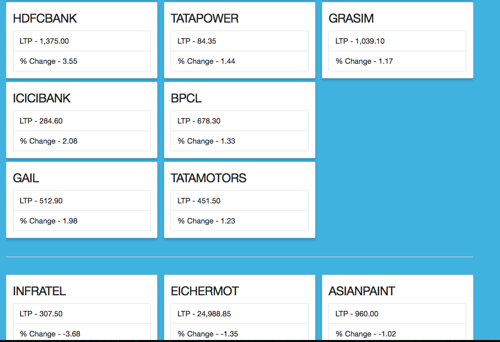

# Extract Nifty50 from NSE India
Python module to extract data from NSE India for Nifty50
This tool will scrape data every 5 min in background and in a different thread. The
data is saved in Redis as a hash with key "data".

## Requirements & Installation

Clone the repository and then install it.

This package needs to run selenium's webdriver which needs Chrome (or Firefox)
binary available in path. Follow these instructions for its installation

NOTE: You may have to use `sudo` for following commands
```
$ apt-get update
$ apt-get install -y unzip
$ wget -O /tmp/chromedriver.zip http://chromedriver.storage.googleapis.com/2.20/chromedriver_linux64.zip && sudo unzip /tmp/chromedriver.zip chromedriver -d /usr/bin/
$ apt-get install xvfb
$ apt-get -y install libxpm4 libxrender1 libgtk2.0-0 libnss3 libgconf-2-4
$ apt-get -y install google-chrome-stable
$ apt-get -y install xvfb gtk2-engines-pixbuf
$ apt-get -y install xfonts-cyrillic xfonts-100dpi xfonts-75dpi xfonts-base xfonts-scalable

$ Xvfb -ac :99 -screen 0 1280x1024x16 &
$ export DISPLAY=:99
```

Package requirements are handled using pip. Make sure you are in root of package and then do
```
$ pip install -r requirements.txt
```

## Examples
```
>>> from nifty50.job import ScrapeNifty50
>>> scrapper = ScrapeNifty50()
>>> gainers = scraper.get('gainers')
>>> losers = scraper.get('losers')
```

## Running main application

Make sure you are in the root of package
```
$ python app.py
$ # OR
$ python -m nifty50.app
```



## Note
Using `python app.py` will start a local server, if thats not what you want then
add these lines in `app.py` in package root:
```
global_conf = {"global": {
    "server.socket_host": '0.0.0.0',
    "server.socket_port": 8000,
}}
cherrypy.config.update(global_conf)
```
(Check `develop` branch)

# DISCLAIMER
`This tool is an example application that can be used for scraping but in no way its
implied to do so. Use this tool at your own discretion`